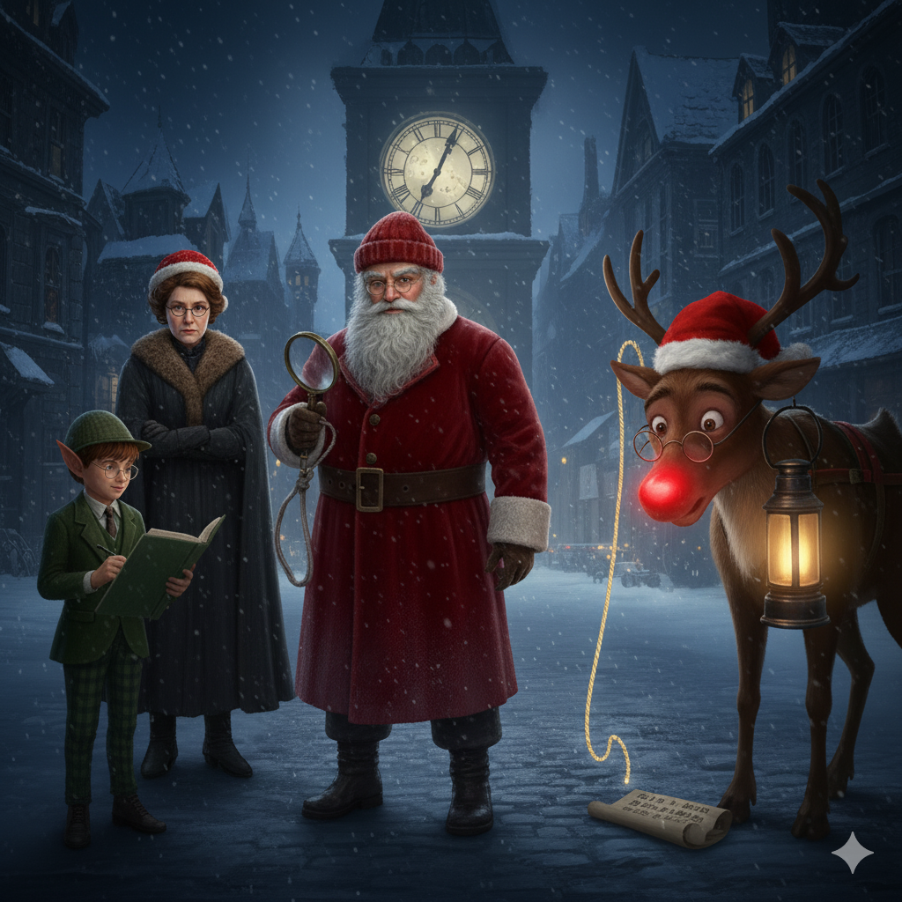

<h1 align="center">
🎅 North Pole Noir: The Missing Sack 🕵
</h1>

# North Pole Noir
North Pole Noir is an AI-powered interactive mystery game built with Streamlit. Set in a snowy, atmospheric North Pole, the player takes on the role of a detective tasked with finding Santa’s Great Toy Sack, which has been stolen just hours before Christmas Eve. Players must solve the theft of Santa's Great Toy Sack by interrogating suspects and piecing together clues before Christmas Eve ends. A Llama 3.3 model is integrated to generate the answers of the characters.

<div id="badges" align="center">
    
</div>

---

## ✨ Features

- Dynamic AI Interrogations: Powered by **Groq (Llama 3.3)**, suspects provide unique, non-repetitive answers based on their role and "Stress Level".
- Immersive Noir UI: Custom CSS including "Icy" titles, animated snowfall effects, and specialized parchment-style popups.
- Multilingual Support: Fully localized gameplay in both **English** and **Italian**.
- Detective Notebook: A persistent sidebar log that tracks all questions and answers throughout the session.
- Smart Game Logic: Randomized scenarios where roles (culprit vs. witness) and evidence change every time you play.

---

### 🚀 Technical Setup

### 1. Requirements
* Python 3.9+
* Streamlit
* Groq API Key

### 2.Project architecture

- main.py: The UI controller managing views (Landing, Hall, Room, Game Over).
- logic.py: Handles AI prompt engineering, stress mechanics, and session state.
- data.py: Contains the personality profiles, alibis, and multilingual translations.
- styles.py: Custom CSS injections and the create_snow_effect animation.

### 3. Installation
```bash
git clone [https://github.com/your-username/north-pole-noir.git](https://github.com/your-username/north-pole-noir.git)
cd north-pole-noir

pip install streamlit groq 


